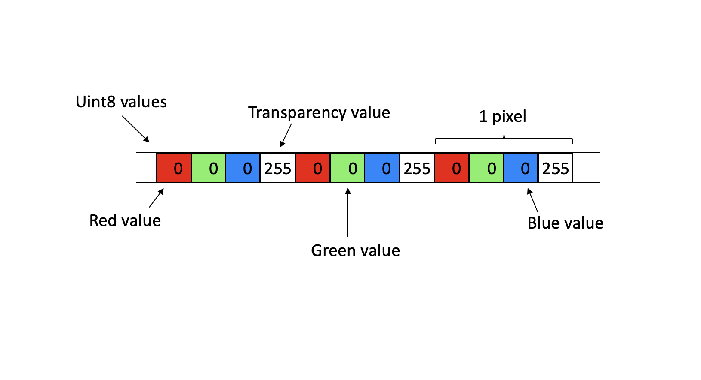
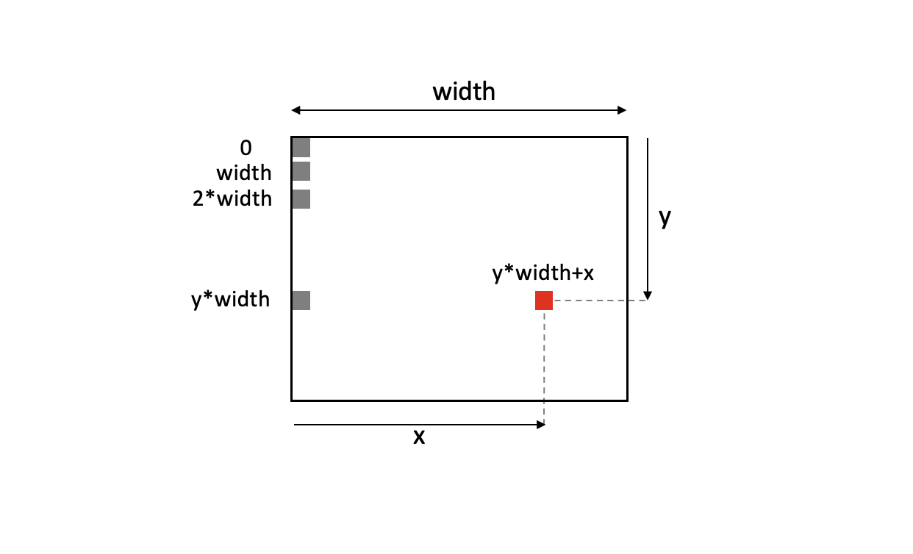

# Setting up the browser to draw pixels

In this section we will use the `<canvas>` element to draw individual pixels on the screen. This will set the stage for drawing actual triangles - which we will go through in the section after this one.

## The drawing surface

To be able to draw triangles in a browser window, we need a surface to draw on. This is provided by the `<canvas>` tag - a block element that can receive sizing parameters - both as element attributes, _and_ via CSS styling. Why both?

The `width` and `height` properties of `<canvas>` define the number of pixels the canvas will contain - horizontally and vertically.

Most graphical applications use the value of the `window.devicePixelRatio` property to scale the size of the canvas. This way the code can utilize high DPI hardware if you have that.

However, in this tutorial we will set up a low resolution surface. We want each pixel to be large so that we can see what is going on when we draw triangles. We therefore use a custom `devicePixelRatio` value to specify the scale - and a value of 0.2 works well for our case.

```JavaScript
const canvas = document.getElementById("canvas");
const devicePixelRatio = 0.2;

canvas.width = window.innerWidth * devicePixelRatio;
canvas.height = window.innerHeight * devicePixelRatio;
```

When we want to set the _size_ of the element (the extents in the browser window) we use CSS. In JavaScript:

```JavaScript
canvas.style.width = window.innerWidth + "px";
canvas.style.height = window.innerHeight + "px";
```

Together, these code snippets set up a canvas element for us to work on. It covers the entire browser window and will have a resolution along x and y that is 20% of the native resolution for a normal-DPI screen. That means, one canvas pixel will cover 5 pixels in each direction, for a total of 25 pixels.

However, there is still something left. Browsers will in general try to improve low resolution graphics by smoothing out pixels. This means that anything we draw on our canvas would end up looking blurry. We want the opposite: We want to see sharp, boxy pixels on the screen. To achieve that, we style the `<canvas>` element with some CSS that tells the browser not to do smoothing:

```HTML
<canvas id="canvas" style="image-rendering:pixelated;"></canvas>
```

## Pixels in the browser

The canvas element object - that we can access from JavaScript - also has an array that stores the color values for all the pixels it contains. The array contains 4 Uint8 (byte) values per pixel - one value for each of the red, blue, green and transparency (alpha) channels. After those 4 values come the 4 values for the next pixel. The array is one-dimensional, you cannot send it x and y values directly.



To draw a pixel at a specific (x, y) location on screen, we need to convert the x and y values to an array index that then will point to the right location in the array. The correct value is `4 * (y * width + x)`. The multiplication by 4 is needed since we address bytes, and there are 4 byte values per pixel. At this array location we can then start writing byte values - red, green, blue and transparency values. The minimum value we can write is 0 (no intensity) and the maximum is 255 (full intensity). The resulting color of the pixel will be a mix of the three color intensities and the transparency. In this tutorial we will not use transparency, so we write a value of 255 - which means a completely opaque pixel.

Note: In the canvas coordinate system, (0, 0) is the top left pixel. The x-axis goes to the right, and the y-axis goes downwards. This is how the array addressing looks like if each pixel consisted of one byte:



(As mentioned the array index must be multiplied by 4 since there are 4 bytes in each pixel in our setup.)

When drawing, we will actually not write values directly to the canvas array. Instead, we create a separate array (often called a buffer), draw on that, and then copy the buffer contents over to the canvas array. This way of doing things eliminates flicker that might otherwise appear if we draw directly to the screen while it is being refreshed. The screen refreshes 60 times per second and although we already synchronise our drawing with the screen refresh rate, we will use an intermediate buffer. The reason is that it is more efficient to draw into a buffer in RAM, and then send the full buffer to the GPU in one go, rather than sending lots of small updates directly to the GPU.

How do we create this buffer? First, we need get the so-called `drawing context` for the canvas element:

```JavaScript
const ctx = canvas.getContext("2d");
```

Then, we get hold of the buffer. Note that we need to specify a width and a height, which for us is the same as the full canvas:

```JavaScript
const screenBuffer = ctx.createImageData(window.innerWidth * devicePixelRatio, window.innerHeight * devicePixelRatio);
```

After having set all of the pixel values in the buffer, we put the contents on screen. (The two last parameters specify the pixel location in the canvas where the top left corner of the buffer should be placed).

```JavaScript
ctx.putImageData(screenBuffer, 0, 0);
```

And with that, we have all we need to start drawing triangles in the browser! Let's do that in the [next section](https://github.com/kristoffer-dyrkorn/software-renderer/tree/main/tutorial/3#readme)!
