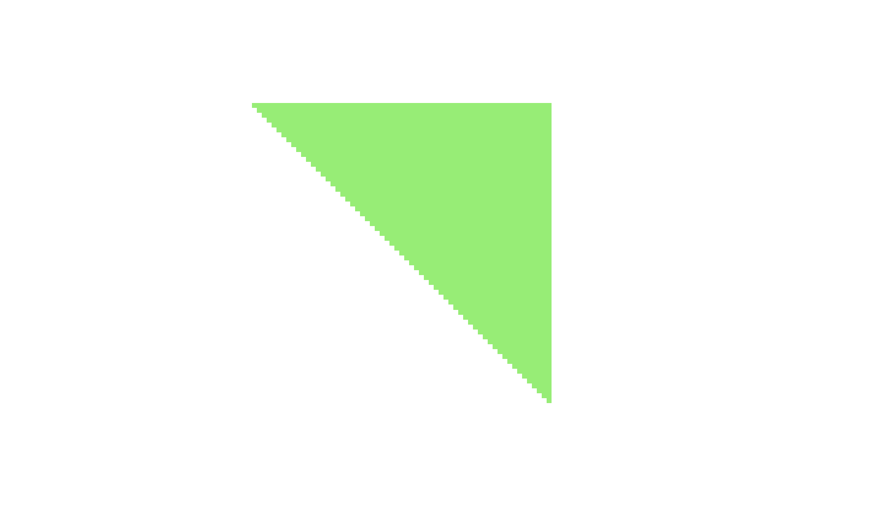

# The first, basic rasterizer

In this section, we will _finally_ get to draw a triangle on the screen - using the method we have described in section 1 and the setup code from section 2.

## The application code

Let's get started. Take a look at this code:

```JavaScript
const vertices = [];
vertices.push(new Vector(140, 100, 0));
vertices.push(new Vector(140, 40, 0));
vertices.push(new Vector(80, 40, 0));

const greenTriangleIndices = [0, 1, 2];
const greenTriangle = new Triangle(greenTriangleIndices, screenBuffer);

const color = new Vector(120, 240, 100);

greenTriangle.draw(vertices, color);
```

Here, we create an array of vertex coordinates for three vertices in a triangle, define indices to those vertices, instantiate a `Triangle` object, define a triangle color by its red, green and blue values, and then draw the triangle using the vertex coordinate array and the specified color.

This code relies on the same `Vector` class that we mentioned earlier. We use that for coordinates, colors and other numbers that need to be grouped together.

Note that we set the vertex indices in the constructor, and keep the vertex coordinates in an array by themselves. This way the vertices can be moved around on screen without impacting the basic structure of a triangle - ie which vertices it contains. (We will return to this subject later when we will start animating our triangles.)

Also see that the vertices are specified in counterclockwise order, as mentioned in the first section.

## The triangle code

Let's have a look at the start of the triangle drawing method - ie the actual rasterizer:

```JavaScript
draw(screenCoordinates, color) {
    // get screen coordinates for this triangle
    const va = screenCoordinates[this.va];
    const vb = screenCoordinates[this.vb];
    const vc = screenCoordinates[this.vc];

    const determinant = this.getDeterminant(va, vb, vc);

    // backface culling: only draw if determinant is positive
    // in that case, the triangle is ccw oriented - ie front-facing
    if (determinant <= 0) {
        return;
    }

    (...)

```

The first step is to read out the actual vertex coordinates from the array provided in the parameter, using the indices originally set in the constructor. We name the three vertices `va`, `vb` and `vc`. They are three-dimensional `Vector`s, ie having x, y and z coordinates. (For now we will not use the z coordinates)

We then check the winding order of the triangle vertices. For our rasterizer to work correctly, the vertices must be provided in counter-clockwise order. We use the determinant function to verify this, and only draw the triangle if the determinant value is positive. (If the determinant is zero then the triangle has zero area, and can be skipped).

The next step is to find the minimum and maximum coordinates for the vertices. These form the corner coordinates of the bounding box enclosing the triangle. We also calculate the index in the pixel buffer that points to the pixel at the upper left corner of the bounding box, and the stride (change in index value) when going from one pixel in the buffer to the pixel directly below.

Then we define two `Vector`s, one to hold a variable `w` (that will be explained shortly) and one to hold the variable `p` which contains the x- and y-coordinates of the current candidate pixel.

```JavaScript
    const xmin = Math.min(va[0], vb[0], vc[0]) - 1;
    const ymin = Math.min(va[1], vb[1], vc[1]) - 1;

    const xmax = Math.max(va[0], vb[0], vc[0]) + 1;
    const ymax = Math.max(va[1], vb[1], vc[1]) + 1;

    let imageOffset = 4 * (ymin * this.buffer.width + xmin);

    // stride: change in raster buffer offsets from one line to next
    const imageStride = 4 * (this.buffer.width - (xmax - xmin));

    // w = edge distances
    const w = new Vector();

    // p = screen coordinates
    const p = new Vector();
```

The code that follow looks like this:

```JavaScript
    for (let y = ymin; y < ymax; y++) {
        for (let x = xmin; x < xmax; x++) {
            p[0] = x;
            p[1] = y;

            w[0] = this.getDeterminant(vb, vc, p);
            w[1] = this.getDeterminant(vc, va, p);
            w[2] = this.getDeterminant(va, vb, p);

            if (w[0] >= 0 && w[1] >= 0 && w[2] >= 0) {
                this.buffer.data[imageOffset + 0] = color[0];
                this.buffer.data[imageOffset + 1] = color[1];
                this.buffer.data[imageOffset + 2] = color[2];
                this.buffer.data[imageOffset + 3] = 255;
            }
            imageOffset += 4;
        }
        imageOffset += imageStride;
    }
}
```

We are now at the heart of the rasterizer. We loop through all pixels inside the bounding box and calculate three different determinants, each of them based on two of the triangle vertices plus the current pixel.

We store the determinant values in a vector `w`. If all three `w` components are larger than - or equal to - zero, the pixel will belong to the triangle, and we write RGB and transparency values (as mentioned, the a transparency value of 255 means "not transparent") to the specified offsets in the pixel buffer - before updating the offsets so they keep pointing to the right screen locations when running through the two loops.

Now - the result looks like this:

<p align="center">

</p>

And with that, we have our first, basic, rasterizer up and running! Go to the [next section](https://github.com/kristoffer-dyrkorn/software-renderer/tree/main/tutorial/4#readme) to see how we are going refine it.
