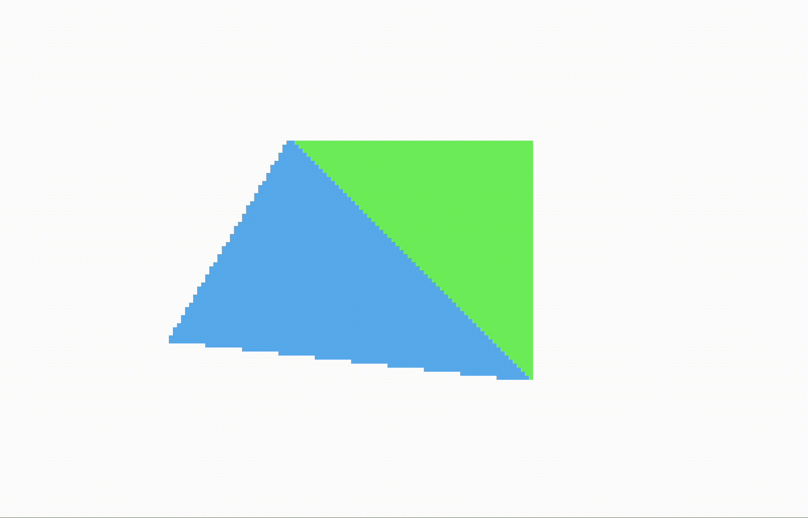

# We've got to move it

In this section, we will start animating our triangles - we will make them rotate on the screen!

## The application code

To make our triangles rotate, it is sufficient to make the vertices rotate. Remember, the triangle objects themselves just contain references to vertex coordinates, so as long as the values in the vertex coordinate array are updated, everything will be correct.

Also, the notion of sharing edges and vertices might become clearer now: By making triangles share vertices, we save calculations: It is sufficient to rotate a vertex just once, and all triangles that use that vertex will then be updated. Also, if we instead had chosen to duplicate vertices among triangles, there is a risk that small errors in calculations might move duplicate vertices apart, thus creating cracks or overlaps between the triangles. We would very much like to avoid that. (We will return to the topic of precision later on in this tutorial.)

Now, back to the code. We start by keeping our existing vertex coordinate array as it is. In addition, we create an array that will hold our rotated vertices, and we initialize it to contain empty `Vector` objects.

```JavaScript
const rotatedVertices = Array.from({ length: 4 }, () => new Vector());
```

To rotate the vertices, we first move them so all vertices are centered around origo, then do the rotation, and then move them back to where they originally were centered. This way we make them rotate around their own centers. (If we don't move them to origo before rotating, they would instead rotate around the _screen coordinates_ origo, which is the top left corner of the screen.) Then we round the result to the nearest integer pixel coordinate, and store the values in the array of rotated vertices.

```JavaScript
function rotate(angle) {
    const DEG_TO_RAD = Math.PI / 180;

    for (let i = 0; i < 4; i++) {
        const v = new Vector(vertices[i]);
        v.sub(center);

        const r = rotatedVertices[i];
        r[0] = Math.round(v[0] * Math.cos(angle * DEG_TO_RAD) - v[1] * Math.sin(angle * DEG_TO_RAD));
        r[1] = Math.round(v[0] * Math.sin(angle * DEG_TO_RAD) + v[1] * Math.cos(angle * DEG_TO_RAD));

        r.add(center);
    }
}
```

In each full screen repaint, we base all our calculations on the same unrotated vertices, and just increase the rotation angle a little bit per frame. This way we make the vertices (this, the triangles as well) rotate. We could also have decided to start with the coordinates from the previous screen paint, and rotate them with some fixed, small amount, but that would mean that small errors in the calculations would accumulate. So doing everything from scratch is more precise - and has no performance penalty. (The work to rotate vertices stays the same, only the rotation amount changes.)

In the code, we set up a function that will be run each frame. Inside the function, we first rotate the vertices, clear the pixel buffer, draw the triangles into the buffer, and then put the buffer onto the screen - and increase the rotation angle.

We use the `requestAnimationFrame` method to synchronise the drawing and rotation with the screen refresh rate. The code looks like this:

```JavaScript
 function draw() {
    requestAnimationFrame(draw);

    rotate(angle);
    screenBuffer.data.fill(0);
    greenTriangle.draw(rotatedVertices, greenColor);

    if (drawBlue) {
        blueTriangle.draw(rotatedVertices, blueColor);
    }

    ctx.putImageData(screenBuffer, 0, 0);
    angle += angleSpeed;
}
```

We are now ready to inspect the results. Not bad - the triangles are indeed rotating, but notice: The movement is not smooth - the triangles seem to jump around a bit as they rotate.



This can be improved, check out the [next section](https://github.com/kristoffer-dyrkorn/software-renderer/tree/main/tutorial/6#readme)!
