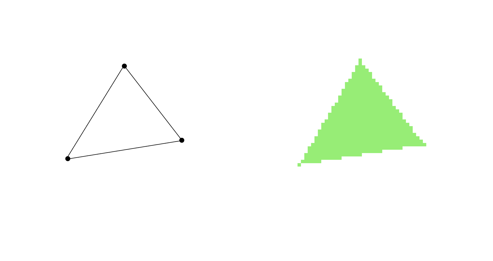
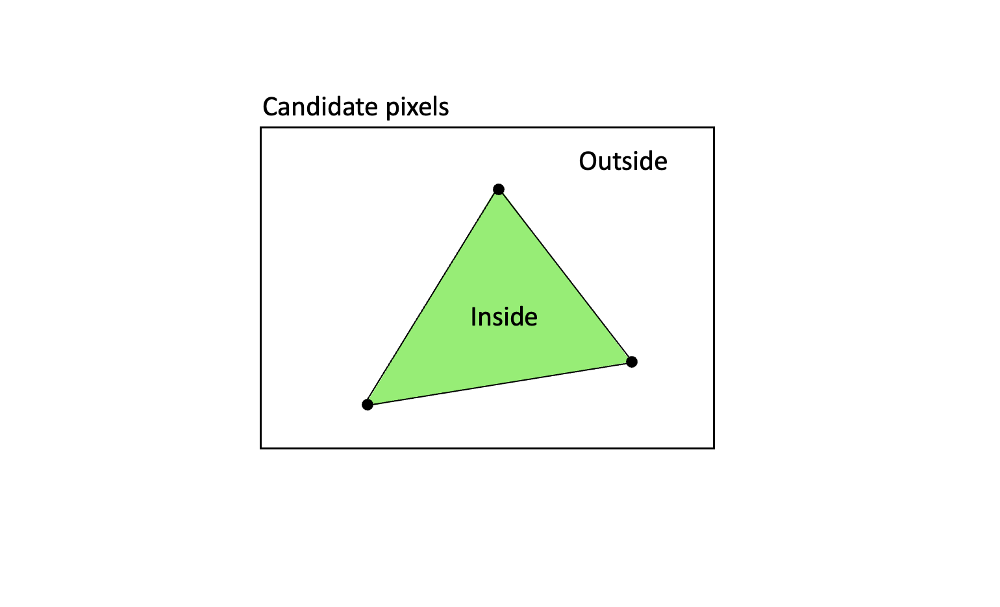
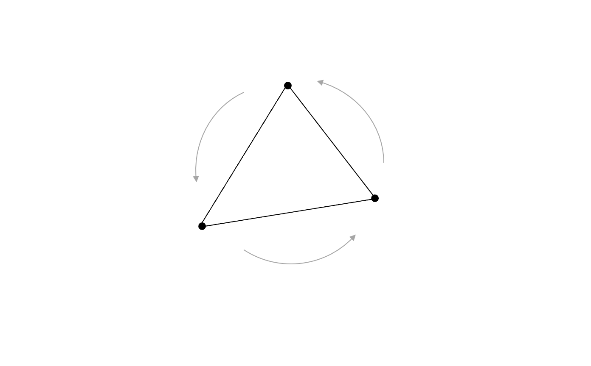
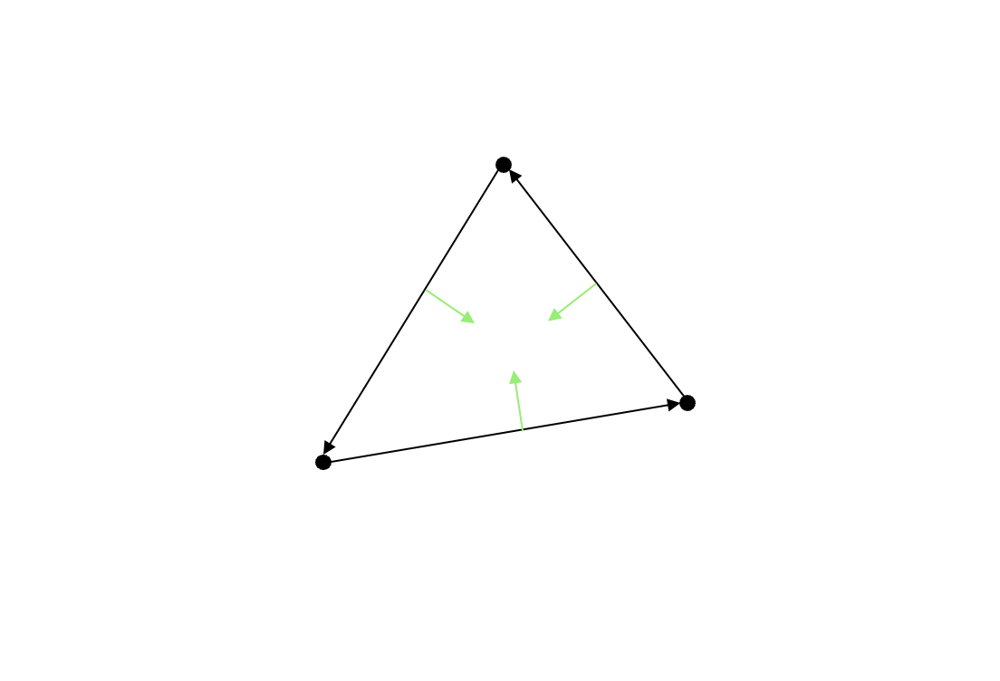
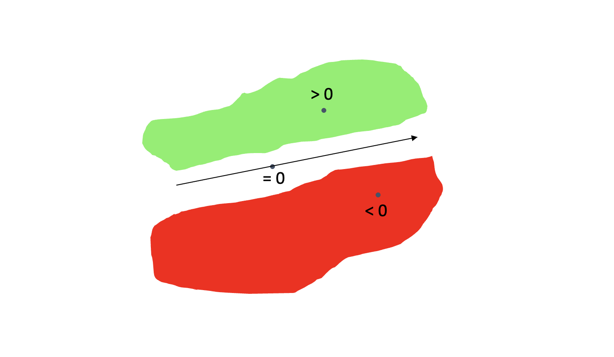
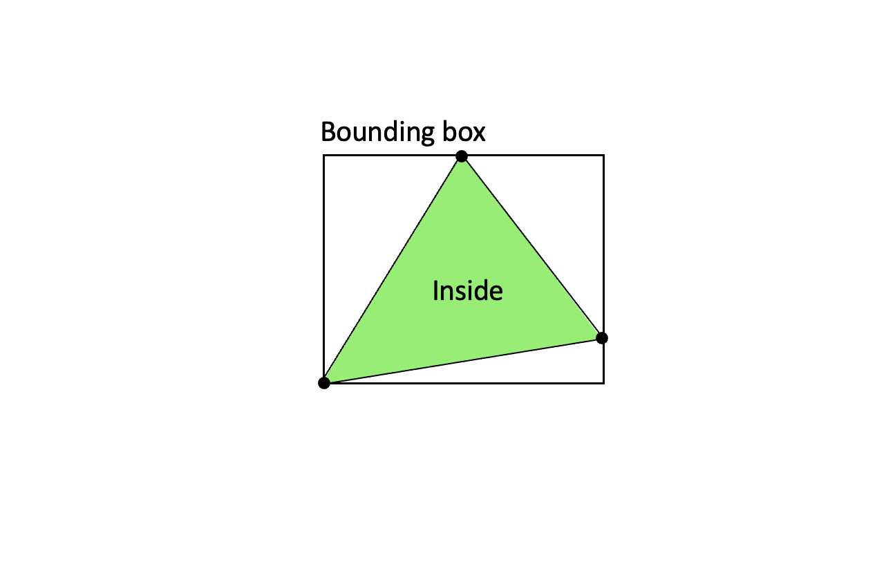

# A fast and correct triangle rasterizer

In this article series, you will get to learn how a computer draws a triangle on screen. This may sound like a silly thing to study, but if you go through the series you will likely discover that there are details, tradeoffs and complexity that you would not have thought about up front.

This is not unusual in the field of computer graphics - or even computer science: If you stumble upon a problem and ask yourself: "Can it be that hard" - then well, yes, sometimes it can! Drawing a triangle on screen correctly and efficiently is certainly not trivial. And at the same time, it is considered an "old" and "already solved" problem. However, that should not stop us from diving into the subject. Depending on your experience and skill level there are likely things to learn here, things that will be applicable in other fields related to programming - for example maths, numerics, computer graphics or performance optimization.

To begin with, let's have a look at what it means to draw a triangle on the screen. This process is often called triangle rasterization. The term can be explained like this: A triangle is defined by three points (vertices). By drawing lines between each of them the triangle appears.

However, on a computer screen we cannot draw lines directly, instead we need to draw pixels. Put differently: We need to change the colors for a given set of pixels on screen. They are organized in a regular grid, a _raster_, and this is what gives us the name: By rasterization we mean the process of figuring out how to draw a graphical object - defined by points or lines - on a pixel screen.

<p align="center">

</p>

This tutorial is structured as follows: First, you will get to know the principles behind triangle rasterization and more details about the approach we will be using. Then we will write code that will become a simple, first version of a rasterizer. Then we will gradually refine it as we see needs for improvements. The final section in this tutorial looks at performance optimizations - and as you will see, the changes we make there will give a 10-time increase in speed.

Enjoy!

## Sections

1. [A walkthrough of the method](#1-a-walkthrough-of-the-method)
1. [Setting up the browser to draw pixels](#2-setting-up-the-browser-to-draw-pixels)
1. [The first, basic rasterizer](https://github.com/kristoffer-dyrkorn/software-renderer/tree/main/tutorial/3#readme)
1. [Moar triangles, moar problems](https://github.com/kristoffer-dyrkorn/software-renderer/tree/main/tutorial/4#readme)
1. [We've got to move it](https://github.com/kristoffer-dyrkorn/software-renderer/tree/main/tutorial/5#readme)
1. [Let's go continuous!](https://github.com/kristoffer-dyrkorn/software-renderer/tree/main/tutorial/6#readme)
1. [One solution, but two new problems](https://github.com/kristoffer-dyrkorn/software-renderer/tree/main/tutorial/7#readme)
1. [Let's fix this](https://github.com/kristoffer-dyrkorn/software-renderer/tree/main/tutorial/8#readme)
1. [Time to go incremental](https://github.com/kristoffer-dyrkorn/software-renderer/tree/main/tutorial/9#readme)

# 1. A walkthrough of the method

(This article is part of a [series](#sections). You can jump to the [previous section](#readme) or the [next section](#2-setting-up-the-browser-to-draw-pixels) if you would like to.)

In this section, you will get to know the principles behind the rasterization method we will use.

## Introduction

The method was first published by Juan Piñeda in 1988, in a paper called ["A Parallel Algorithm for Polygon Rasterization"](https://www.cs.drexel.edu/~david/Classes/Papers/comp175-06-pineda.pdf). As the title says, it was made for parallel execution, something we will not have here, but since the algorithm actually is quite simple, and also well suited for serial execution, we will use it here.

If you search for triangle rasterization on the web, you will likely find many implementations of Piñeda's algorithm. The oldest one I have found is by Nicolas Capens, posted on the site `devmaster.net` (a game developer forum) back in 2004. His code seems to be the original one that has inspired most of the other triangle rasterizer implementations you will find. That web site does not exist anymore, but The Internet Archive [has a copy of the posting](https://web.archive.org/web/20120220025947/http://devmaster.net/forums/topic/1145-advanced-rasterization/) if you are interested.

## The inside test

Piñeda's method is based on scanning an region of candidate pixels, and for each candidate inside that region, finding out whether or not that pixel lies inside the triangle. If it is inside, the pixel is painted with the requested triangle color.

<p align="center">

</p>

To do this efficiently, we have to set up our triangles in a specific way: We orient the vertices in a consistent order - which here is chosen to be counterclockwise. So, when going from any vertex and to the next, and then to the last one in the triangle, we will make a counterclockwise turn.

<p align="center">

</p>

As long as all triangles to be drawn follow that convention, we can define a rule that will decide if a pixel is inside a triangle or not: "If a candidate pixel lies to the left of all three edges when we visit the vertices in order, then the pixel is inside the triangle."

<p align="center">

</p>

Finding out if a pixel lies to the left of an edge is not so hard. We can use a function that takes three coordinates as parameters - an edge start point, an edge end point, and a candidate pixel - and that returns a positive, zero or negative value. The result is positive if the candidate pixel is to the left of the edge, it will be zero if the pixel is exactly on the edge, and negative if the pixel is to the right.

<p align="center">

</p>

In code, such a function can look like this:

```JavaScript
getDeterminant(a, b, c) {
    const ab = new Vector(b);
    ab.sub(a);

    const ac = new Vector(c);
    ac.sub(a);

    return ab[1] * ac[0] - ab[0] * ac[1];
}
```

The function receives three inputs `a`, `b` and `c`. The edge coordinates are `a` and `b`, and the candidate pixel coordinates is `c`. (A `Vector` here simply represents an array of values - where the value at index 0 is the x-coordinate, and at the value at index 1 is the y-coordinate.)

The code calculates two vectors `ab` and `ac`. These vectors describe the differences in x- and y-coordinates when going from `a` to `b` and from `a` to `c`. It then cross-multiplies those vectors. This is the same as calculating what is called a determinant - if the vectors were organized in a 2-by-2 matrix. In this tutorial, we will call the result of this calculation a determinant value.

We repeat this edge test for each of the three edges in the triangle - and by doing so we have an inside test for the triangle itself.

## Finding candidate pixels

At this point, we have a working test - as long as the vertices are specified in a counterclockwise order. The next question is: Which pixels should we test?

The first idea could be to just test all pixels on screen, but we can be more efficient than that - we could test just the pixels inside a bounding box enclosing the triangle. This way we test fewer pixels, but still all that are needed. If calculating a bounding box is fast (faster than testing the pixels outside it), then this will be the faster solution.

Taking the minimum and maximum values of all the vertex coordinates gives us the coordinates of the bounding box. This is a very fast operation, so we will use that optimzation here.

In code, finding the corner points of the bounding box looks like this:

```JavaScript
const xmin = Math.min(va[0], vb[0], vc[0]);
const ymin = Math.min(va[1], vb[1], vc[1]);

const xmax = Math.max(va[0], vb[0], vc[0]);
const ymax = Math.max(va[1], vb[1], vc[1]);
```

Here, the `Vectors` `va`, `vb` `vc` contain the vertex coordinates of the triangle.

<p align="center">

</p>

## Drawing the triangle

Now we have all we need: We can loop through all points inside the triangle bounding box, we can calculate three determinant values (based on each of the triangle edges and the candidate pixel), and if all the determinant values are positive, we know that the candidate pixel is inside the triangle. (The determinant even has the nice property that the value is proportional to the shortest distance between the pixel and the edge.)

If we are inside we paint the pixel with the desired triangle color. (For now we also assume that a pixel exactly on a triangle edge also belongs to that triangle.)

The code could look like this:

```JavaScript
for (let y = ymin; y < ymax; y++) {
    for (let x = xmin; x < xmax; x++) {
        p[0] = x;
        p[1] = y;

        w[0] = getDeterminant(vb, vc, p);
        w[1] = getDeterminant(vc, va, p);
        w[2] = getDeterminant(va, vb, p);

        if (w[0] >= 0 && w[1] >= 0 && w[2] >= 0) {
            drawPixel(p, color)
        }
    }
}
```

The code here draws pixels - something we have not explained yet. Don't worry, we will get to that in the next section - where we go through how to set up the browser to run code and draw pixels one by one.

# 2. Setting up the browser to draw pixels

(This article is part of a [series](#sections). You can jump to the [previous section](#1-a-walkthrough-of-the-method) or the [next section](#2-setting-up-the-browser-to-draw-pixels) if you would like to.)

In this section we will use the `<canvas>` element to draw individual pixels on the screen. This will set the stage for drawing actual triangles - which we will go through in the section after this one.

## The drawing surface

To be able to draw triangles in a browser window, we need a surface to draw on. This is provided by the `<canvas>` tag - a block element that can receive sizing parameters - both as element attributes, _and_ via CSS styling. Why both?

The `width` and `height` properties of `<canvas>` define the number of pixels the canvas will contain - horizontally and vertically.

Most graphical applications use the value of the `window.devicePixelRatio` property to scale the size of the canvas. This way the code can utilize high DPI hardware if you have that.

However, in this tutorial we will set up a low resolution surface. We want each pixel to be large so that we can see what is going on when we draw triangles. We therefore use a custom `devicePixelRatio` value to specify the scale - and a value of 0.2 works well for our case.

```JavaScript
const canvas = document.getElementById("canvas");
const devicePixelRatio = 0.2;

canvas.width = window.innerWidth * devicePixelRatio;
canvas.height = window.innerHeight * devicePixelRatio;
```

When we want to set the _size_ of the element (the extents in the browser window) we use CSS. In JavaScript:

```JavaScript
canvas.style.width = window.innerWidth + "px";
canvas.style.height = window.innerHeight + "px";
```

Together, these code snippets set up a canvas element for us to work on. It covers the entire browser window and will have a resolution along x and y that is 20% of the native resolution for a normal-DPI screen. That means, one canvas pixel will cover 5 pixels in each direction, for a total of 25 pixels.

However, there is still something left. Browsers will in general try to improve low resolution graphics by smoothing out pixels. This means that anything we draw on our canvas would end up looking blurry. We want the opposite: We want to see sharp, boxy pixels on the screen. To achieve that, we style the `<canvas>` element with some CSS that tells the browser not to do smoothing:

```HTML
<canvas id="canvas" style="image-rendering:pixelated;"></canvas>
```

## Pixels in the browser

The canvas element object - that we can access from JavaScript - also has an array that stores the color values for all the pixels it contains. The array contains 4 Uint8 (byte) values per pixel - one value for each of the red, blue, green and transparency (alpha) channels. After those 4 values come the 4 values for the next pixel. The array is one-dimensional, you cannot send it x and y values directly.

<p align="center">

</p>

To draw a pixel at a specific (x, y) location on screen, we need to convert the x and y values to an array index that then will point to the right location in the array. The correct value is `4 * (y * width + x)`. The multiplication by 4 is needed since we address bytes, and there are 4 byte values per pixel. At this array location we can then start writing byte values - red, green, blue and transparency values. The minimum value we can write is 0 (no intensity) and the maximum is 255 (full intensity). The resulting color of the pixel will be a mix of the three color intensities and the transparency. In this tutorial we will not use transparency, so we write a value of 255 - which means a completely opaque pixel.

Note: In the canvas coordinate system, (0, 0) is the top left pixel. The x-axis goes to the right, and the y-axis goes downwards. This is how the array addressing looks like if each pixel consisted of one byte:

<p align="center">

</p>

(As mentioned the array index must be multiplied by 4 since there are 4 bytes in each pixel in our setup.)

When drawing, we will actually not write values directly to the canvas array. Instead, we create a separate array (often called a buffer), draw on that, and then copy the buffer contents over to the canvas array. This way of doing things eliminates flicker that might otherwise appear if we draw directly to the screen while it is being refreshed. The screen refreshes 60 times per second and although we already synchronise our drawing with the screen refresh rate, we will use an intermediate buffer. The reason is that it is more efficient to draw into a buffer in RAM, and then send the full buffer to the GPU in one go, rather than sending lots of small updates directly to the GPU.

How do we create this buffer? First, we need get the so-called `drawing context` for the canvas element:

```JavaScript
const ctx = canvas.getContext("2d");
```

Then, we get hold of the buffer. Note that we need to specify a width and a height, which for us is the same as the full canvas:

```JavaScript
const screenBuffer = ctx.createImageData(window.innerWidth * devicePixelRatio, window.innerHeight * devicePixelRatio);
```

After having set all of the pixel values in the buffer, we put the contents on screen. (The two last parameters specify the pixel location in the canvas where the top left corner of the buffer should be placed).

```JavaScript
ctx.putImageData(screenBuffer, 0, 0);
```

And with that, we have all we need to start drawing triangles in the browser! Let's do that in the next section.

In the mean time, here is the [code for this section](2).

# 3. The first, basic rasterizer

(This article is part of a [series](#sections). You can jump to the [previous section](#2-setting-up-the-browser-to-draw-pixels) or the [next section](#4) if you would like to.)

In this section, we will _finally_ get to draw a triangle on the screen - using the method we have described in section 1 and the setup code from section 2.

## The application code

Let's get started. Take a look at this code:

```JavaScript
const vertices = [];
vertices.push(new Vector(140, 100, 0));
vertices.push(new Vector(140, 40, 0));
vertices.push(new Vector(80, 40, 0));

const greenTriangleIndices = [0, 1, 2];
const greenTriangle = new Triangle(greenTriangleIndices, screenBuffer);

const color = new Vector(120, 240, 100);

greenTriangle.draw(vertices, color);
```

Here, we create an array of vertex coordinates for three vertices in a triangle, define indices to those vertices, instantiate a `Triangle` object, define a triangle color by its red, green and blue values, and then draw the triangle using the vertex coordinate array and the specified color.

This code relies on the same `Vector` class that we mentioned earlier. We use that for coordinates, colors and other numbers that need to be grouped together.

Note that we set the vertex indices in the constructor, and keep the vertex coordinates in an array by themselves. This way the vertices can be moved around on screen without impacting the basic structure of a triangle - ie which vertices it contains. (We will return to this subject later when we will start animating our triangles.)

Also see that the vertices are specified in counterclockwise order, as mentioned in the first section.

## The triangle code

Let's have a look at the start of the triangle drawing method - ie the actual rasterizer:

```JavaScript
draw(screenCoordinates, color) {
    // get screen coordinates for this triangle
    const va = screenCoordinates[this.va];
    const vb = screenCoordinates[this.vb];
    const vc = screenCoordinates[this.vc];

    const determinant = this.getDeterminant(va, vb, vc);

    // backface culling: only draw if determinant is positive
    // in that case, the triangle is ccw oriented - ie front-facing
    if (determinant <= 0) {
        return;
    }

    (...)

```

The first step is to read out the actual vertex coordinates from the array provided in the parameter, using the indices originally set in the constructor. We name the three vertices `va`, `vb` and `vc`. They are three-dimensional `Vector`s, ie having x, y and z coordinates. (For now we will not use the z coordinates)

We then check the winding order of the triangle vertices. For our rasterizer to work correctly, the vertices must be provided in counter-clockwise order. We use the determinant function to verify this, and only draw the triangle if the determinant value is positive. (If the determinant is zero then the triangle has zero area, and can be skipped).

The next step is to find the minimum and maximum coordinates for the vertices. These form the corner coordinates of the bounding box enclosing the triangle. We also calculate the index in the pixel buffer that points to the pixel at the upper left corner of the bounding box, and the stride (change in index value) when going from one pixel in the buffer to the pixel directly below.

Then we define two `Vector`s, one to hold a variable `w` (that will be explained shortly) and one to hold the variable `p` which contains the x- and y-coordinates of the current candidate pixel.

```JavaScript
    const xmin = Math.min(va[0], vb[0], vc[0]) - 1;
    const ymin = Math.min(va[1], vb[1], vc[1]) - 1;

    const xmax = Math.max(va[0], vb[0], vc[0]) + 1;
    const ymax = Math.max(va[1], vb[1], vc[1]) + 1;

    let imageOffset = 4 * (ymin * this.buffer.width + xmin);

    // stride: change in raster buffer offsets from one line to next
    const imageStride = 4 * (this.buffer.width - (xmax - xmin));

    // w = edge distances
    const w = new Vector();

    // p = screen coordinates
    const p = new Vector();
```

The code that follow looks like this:

```JavaScript
    for (let y = ymin; y < ymax; y++) {
        for (let x = xmin; x < xmax; x++) {
            p[0] = x;
            p[1] = y;

            w[0] = this.getDeterminant(vb, vc, p);
            w[1] = this.getDeterminant(vc, va, p);
            w[2] = this.getDeterminant(va, vb, p);

            if (w[0] >= 0 && w[1] >= 0 && w[2] >= 0) {
                this.buffer.data[imageOffset + 0] = color[0];
                this.buffer.data[imageOffset + 1] = color[1];
                this.buffer.data[imageOffset + 2] = color[2];
                this.buffer.data[imageOffset + 3] = 255;
            }
            imageOffset += 4;
        }
        imageOffset += imageStride;
    }
}
```

We are now at the heart of the rasterizer. We loop through all pixels inside the bounding box and calculate three different determinants, each of them based on two of the triangle vertices plus the current pixel.

We store the determinant values in a vector `w`. If all three `w` components are larger than - or equal to - zero, the pixel will belong to the triangle, and we write RGB and transparency values (as mentioned, the a transparency value of 255 means "not transparent") to the specified offsets in the pixel buffer - before updating the offsets so they keep pointing to the right screen locations when running through the two loops.

Now - the result looks like this:

<p align="center">

</p>

And with that, we have our first, basic, rasterizer up and running! Go to the next section to see how we are going refine it.

In the mean time, here is the [code for this section](3).

# 4. Moar triangles, moar problems

(This article is part of a [series](#sections). You can jump to the [previous section](#1-a-walkthrough-of-the-method) or the [next section](#2-setting-up-the-browser-to-draw-pixels) if you would like to.)

In this section, we will take a closer look at what happens when we draw two triangles that share an edge. There are some important details that need to be resolved.

## The application code

It is not so interesting to look at just one triangle on a screen. We need more triangles! So, let's add a blue one. In the application code, it looks like this:

```JavaScript
const vertices = [];
vertices.push(new Vector(140, 100, 0));
vertices.push(new Vector(140, 40, 0));
vertices.push(new Vector(80, 40, 0));
vertices.push(new Vector(50, 90, 0));

const greenTriangleIndices = [0, 1, 2];
const greenTriangle = new Triangle(greenTriangleIndices, screenBuffer);

const blueTriangleIndices = [0, 2, 3];
const blueTriangle = new Triangle(blueTriangleIndices, screenBuffer);

const greenColor = new Vector(120, 240, 100);
const blueColor = new Vector(100, 180, 240);
```

We add another vertex to the array of all vertices, and create a new, separate vertex index array just for the blue triangle. Note that the indices `2` and `0` are shared between the two triangles. This means that the two triangles share an edge - that goes between vertices number 2 and 0.

This is how it looks like:

<p align="center">

</p>

## Oooops

At first, this seems to look just great. But, if we draw first the green triangle, and then the blue one, we will see that there are some blue pixels that are drawn on top of the green ones.

<p align="center">

</p>

This is called overdraw - and it is something we want to avoid. First of all, it will worsen performance, since we spend time drawing pixels that later become hidden by other pixels. Also, the visual quality will suffer: It will make edges between triangles seem to move, depending on which triangle was drawn first. Should we want to use the rasterizer to draw detailed 3D objects with many triangles, we will in general have no control over the sequence the triangles will be drawn in. The result will look awful - the edges will flicker.

You might remember from earlier that we considered all pixels lying exactly on a triangle edge (`w` = 0) to belong to the triangle. What we have here is an unfortunate consequence of that: The pixels along the shared edge between two triangles now belong to both triangles. So they are drawn twice.

## One rule to rule them all

We need to sort out that - and introduce another rule for triangles. The rule that most graphics APIs use, is to say that pixels that lie exactly on a left side edge of a triangle, or on a flat top edge of a triangle, do not belong to that triangle. This is sufficient to cover all cases of shared edges - and make all pixels belong to just one triangle.

<p align="center">

</p>

The rule is often called the "top left" fill rule, and can be implemented like this, in the triangle rasterizer:

```JavaScript
function isLeftOrTopEdge(start, end) {
    const edge = new Vector(end);
    edge.sub(start);
    if (edge[1] > 0 || (edge[1] == 0 && edge[0] < 0)) return true;
}
```

The logic behind is as follows: An edge is a left edge if the change in y coordinate, when moving from the end and to the start of the edge, is larger than zero. An edge is a flat top edge if the change in y coordinate is zero and the change in x is negative.

This way of expressing the fill rule is based on two conventions we already follow in our setup: That the vertices in a visible triangle have counterclockwise order, and that the positive y axis on screen points down. As long as those two hold, then the code will work as intended.

(Side note: We could have chosen the opposite convention, and defined a "bottom right" rule, and that would be just as correct. The point is to have a rule that consistently separates pixels that lie on shared edges, and the "top left" version of this rule has somehow become the standard in computer graphics.)

Now that we have defined the rule, what do we do with it? How do we express that the pixels on the edges that match the rule do not belong to this triangle?

When drawing pixels, we need to make an exception: We will skip those pixels that - according to this new rule - don't belong to the triangle after all. An easy way to do so is to adjust the determinant value. So, whenever an edge is affected by the fill rule (ie is a left edge or a horizontal top edge), we subtract some small amount from that determinant.

This could be considered a dirty trick - since reducing a determinant value essentially moves a triangle edge towards the triangle center. So the adjustment should be as small as possible, while still large enough to work as intended.

The goal here is to make the determinant value for _this_ edge, in the current triangle, differ from the determinant value for pixels on the same edge in the _neighbour_ triangle. This way we create a tie breaking rule - ie some logic that ensures that pixels lying exactly on the shared edge will end up belonging to only one of the triangles - and are thus drawn only once.

How large should the adjustment be? In the setup we have here, all coordinates have integer values. This means that all determinants also have integer values. The resolution - or, smallest expressible value - of the determinant calculation is 1 and that, in turn, means that the smallest possible adjustment value is 1.

```JavaScript
if (isLeftOrTopEdge(vb, vc)) w[0]--;
if (isLeftOrTopEdge(vc, va)) w[1]--;
if (isLeftOrTopEdge(va, vb)) w[2]--;

if (w[0] >= 0 && w[1] >= 0 && w[2] >= 0) {
    this.buffer.data[imageOffset + 0] = color[0];
    this.buffer.data[imageOffset + 1] = color[1];
    this.buffer.data[imageOffset + 2] = color[2];
    this.buffer.data[imageOffset + 3] = 255;
}
```

The rest of the code remains the same.

And with that, we can safely draw lots of triangles - without gaps or overlaps! But, we are not done yet. Go to [the next section](https://github.com/kristoffer-dyrkorn/software-renderer/tree/main/tutorial/5#readme) to see what happens when we start animating the triangles.
